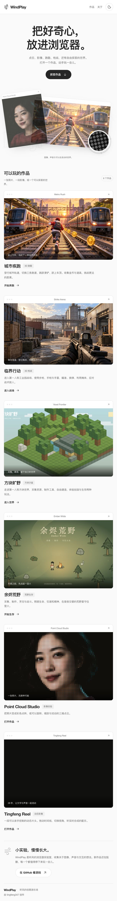
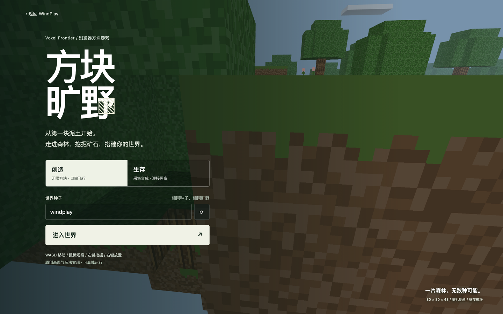
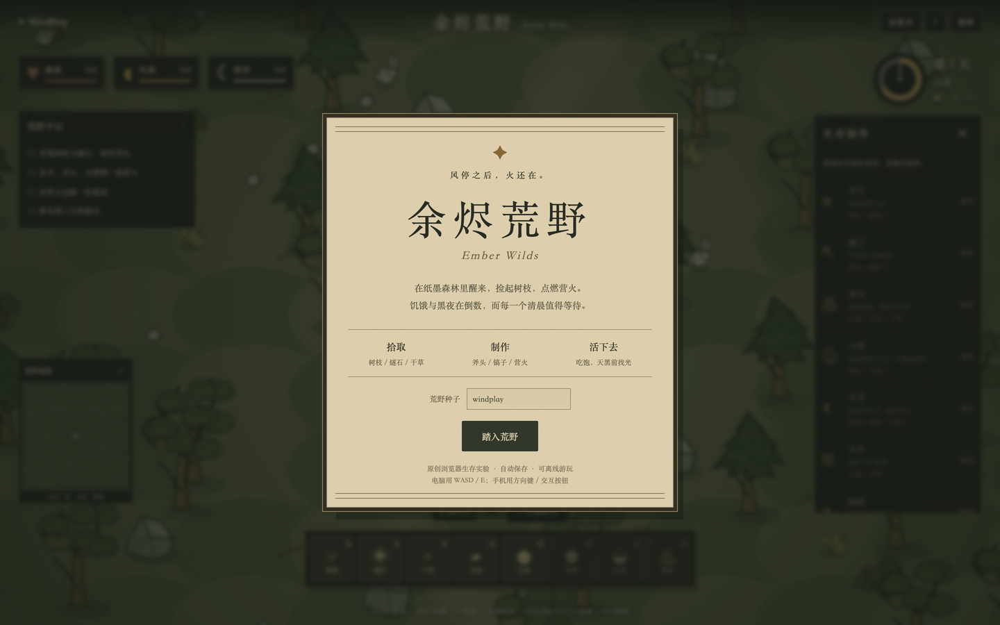
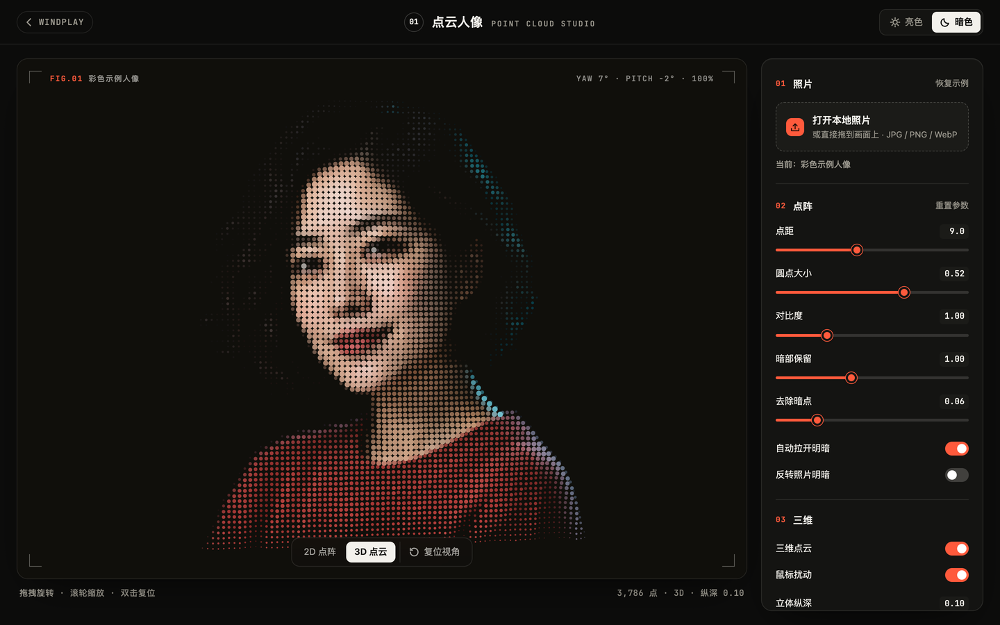
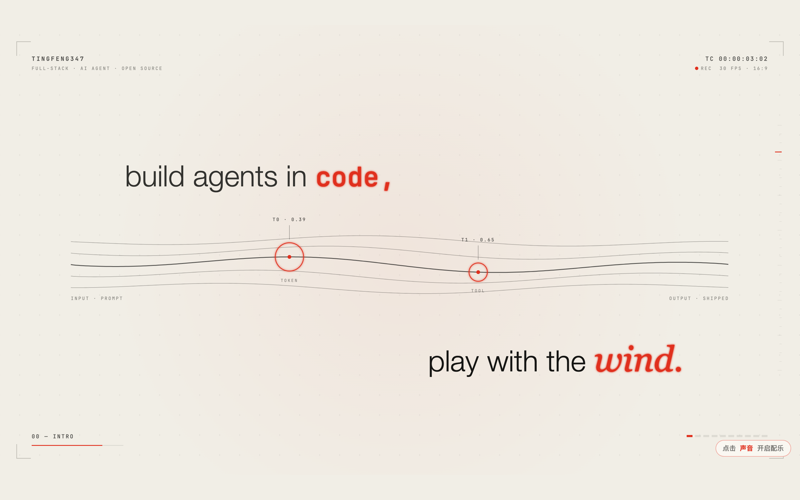

# WindPlay

<p align="center">
  <a href="assets/windplay-logo.svg"><picture><source media="(prefers-color-scheme: dark)" srcset="assets/windplay-logo-dark.svg"></picture></a>
</p>

WindPlay 是一个网页创意实验场，收录点云人像、粒子动画、交互艺术和小游戏。
这里的每个作品都可以独立开发与构建，也可以随着想法成熟继续扩展。

## 启动台



在线体验：[打开 WindPlay](https://tingfeng347.github.io/windplay/)，无需安装依赖。

本地开发：

```bash
npm ci
npm run dev
```

浏览器打开 `http://localhost:4173`，从启动台进入任一作品。不启动服务时也可以直接双击
根目录的 `index.html`；所有链接均使用相对路径。

推送到 GitHub 的 `main` 分支会触发 GitHub Actions，构建并部署到 GitHub Pages。

## 作品

| 作品 | 类型 | 状态 | 说明 |
| --- | --- | --- | --- |
| [城市疾跑 · Metro Rush](works/metro-rush/) | 3D 城市跑酷 | [直接打开成品](https://tingfeng347.github.io/windplay/works/metro-rush/demo/index.html) | 第三人称三道跑酷，包含跳跃、滑铲、列车车顶、金币、道具、任务和角色解锁 |
| [临界行动 · Strike Arena](works/strike-arena/) | 3D 第一人称枪战 | [直接打开成品](https://tingfeng347.github.io/windplay/works/strike-arena/demo/index.html) | 原创工业园战场，包含步枪/手枪、瞄准换弹、手雷、战术敌人、击杀目标与结算 |
| [方块旷野 · Voxel Frontier](works/voxel-frontier/) | 第一人称方块沙盒 | [直接打开成品](https://tingfeng347.github.io/windplay/works/voxel-frontier/demo/index.html) | 我的世界玩法启发的原创方块世界，支持采集、建造、制作、创造/生存模式与本地存档 |
| [余烬荒野 · Ember Wilds](works/ember-wilds/) | 手绘荒野生存 | [直接打开成品](https://tingfeng347.github.io/windplay/works/ember-wilds/demo/index.html) | 饥荒玩法启发的原创生存游戏，包含采集、制作、营火、烹饪、昼夜、敌人与生命/饥饿/精神状态 |
| [Point Cloud Studio](works/point-cloud-studio/) | 点云人像 / 交互工具 | [直接打开成品](https://tingfeng347.github.io/windplay/works/point-cloud-studio/demo/index.html) | 将照片转换为彩色点阵 SVG 和可交互三维点云 |
| [Tingfeng Reel](works/tingfeng-reel/) | 动态片头 / 音画同步 | [直接打开成品](https://tingfeng347.github.io/windplay/works/tingfeng-reel/demo/index.html) | 根据 GitHub 主页编排的 28 秒片头，支持 2D/3D、亮暗主题与合成配乐 |

## 作品预览

### [方块旷野 · Voxel Frontier](works/voxel-frontier/)

[](works/voxel-frontier/demo/index.html)

### [余烬荒野 · Ember Wilds](works/ember-wilds/)

[](works/ember-wilds/demo/index.html)

### [Point Cloud Studio](works/point-cloud-studio/)

[](works/point-cloud-studio/demo/index.html)

### [Tingfeng Reel](works/tingfeng-reel/)

[](works/tingfeng-reel/demo/index.html)

## 目录

```text
windplay/
├── .github/workflows/       # 持续集成
├── assets/                  # 启动台素材与作品截图
├── docs/                    # 仓库级设计与约定
├── scripts/                 # 启动台构建与本地服务
├── tests/                   # 启动台入口检查
├── works/                   # 可独立运行的网页作品
│   ├── point-cloud-studio/  # 点云人像生成器
│   │   └── demo/index.html  # 可直接打开的完整成品
│   ├── tingfeng-reel/       # 动态作品片头
│   ├── voxel-frontier/      # 第一人称方块沙盒
│   └── ember-wilds/         # 手绘荒野生存
├── AGENTS.md                # 自动化协作规则
├── CONTRIBUTING.md          # 新增作品与开发说明
├── index.html               # 作品启动台
├── package.json             # 仓库统一命令和 workspace 声明
├── styles.css               # 启动台样式
└── README.md
```

每个作品自行维护源码、素材、测试、文档和构建脚本。只有被多个作品实际复用的代码，
才会提取到仓库级共享目录，避免为了目录完整而制造空壳。

每个作品的 `demo/index.html` 是提交到 Git 的单文件成品，可以直接双击体验，不需要安装依赖
或启动开发服务。`dist/` 则是构建时生成的完整输出，仍然不会提交。

## 开始使用

需要 Node.js 22 或更新版本，推荐 Node.js 24。

```bash
npm ci
npm run dev --workspace @windplay/point-cloud-studio
```

开发服务启动后，访问终端显示的本机地址。也可以进入作品目录，按该作品 README
中的方式单独开发。

两个游戏也可以用根级快捷命令开发：`npm run dev:voxel` 和 `npm run dev:survival`。
它们的单文件成品支持离线体验，存档保存在当前浏览器中。

## 统一检查

```bash
npm run build
npm test
```

根级命令会依次执行所有已声明对应脚本的作品。新增作品的规则见
[CONTRIBUTING.md](CONTRIBUTING.md)。仓库的目录决策见
[docs/STRUCTURE.md](docs/STRUCTURE.md)。
