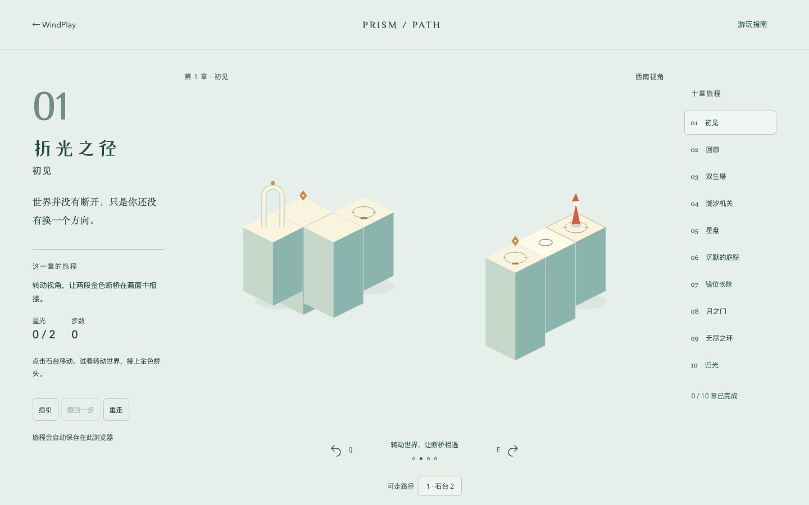
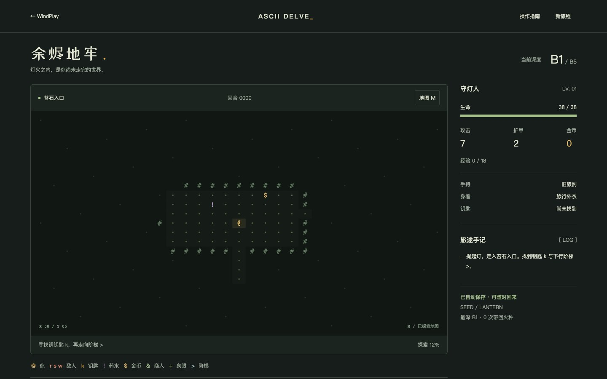
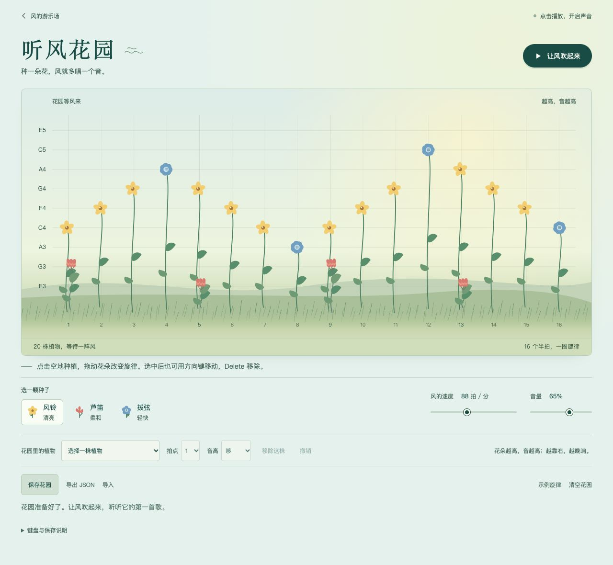
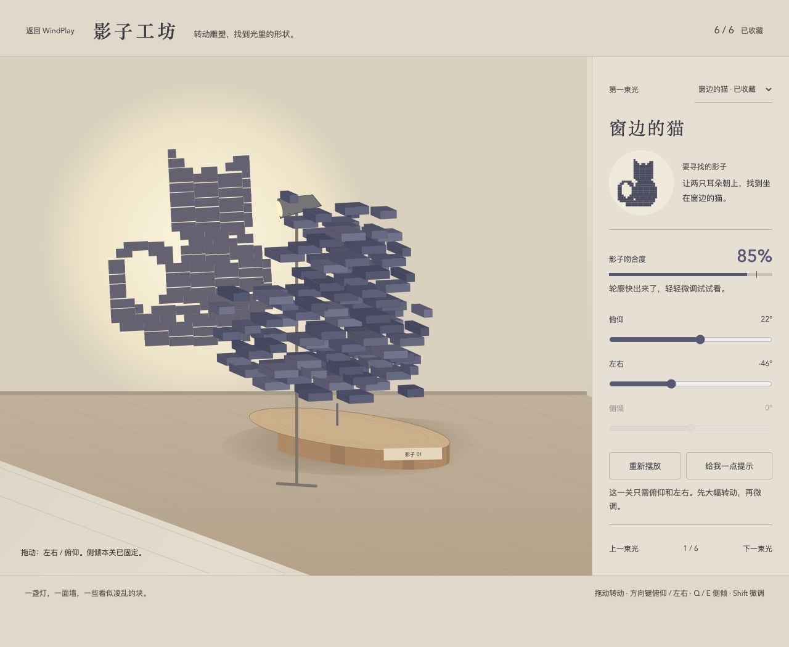
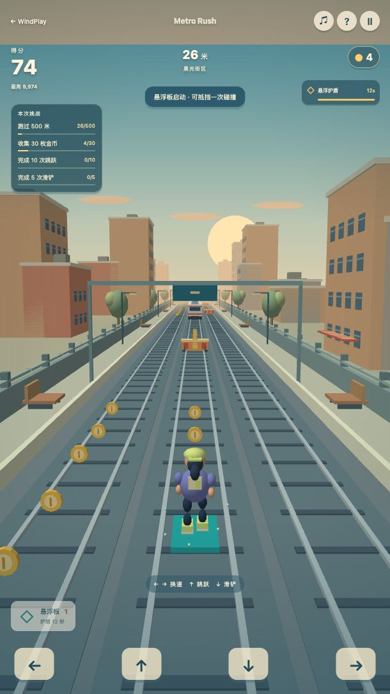
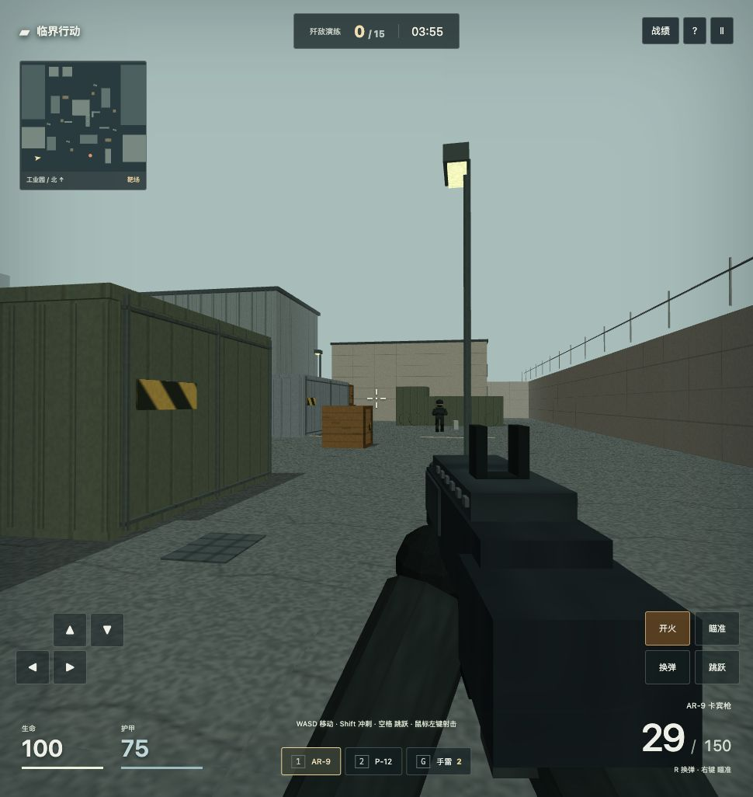
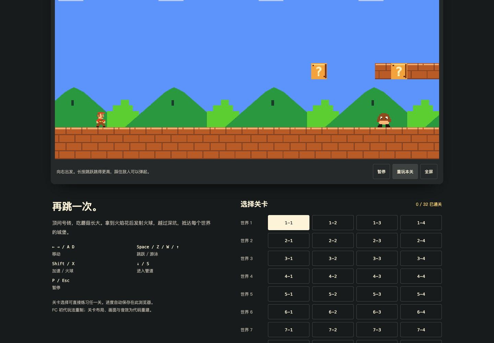

# 作品预览

[桌面启动台](../assets/screenshots/launcher.jpg) · [手机启动台](../assets/screenshots/launcher-mobile.jpg)

## 作品内容

| 作品 | 类型 | 状态 | 说明 |
| --- | --- | --- | --- |
| [折光之径 · Prism Path](../works/prism-path/) | 空间视错觉解谜 | [直接打开成品](https://tingfeng347.github.io/windplay/works/prism-path/demo/index.html) | 十章原创空间解谜。旋转视角连接断桥，收集星光，解开机关，在错位的建筑之间找到归途。 |
| [余烬地牢 · ASCII Delve](../works/ascii-delve/) | ASCII 地牢探索 | [直接打开成品](https://tingfeng347.github.io/windplay/works/ascii-delve/demo/index.html) | 提灯探索五层字符地牢。选择职业，在迷雾中寻找装备、药水与商人，用回合制战斗带回最后的火种。 |
| [听风花园 · Wind Garden](../works/wind-garden/) | 音乐玩具 | [直接打开成品](https://tingfeng347.github.io/windplay/works/wind-garden/demo/index.html) | 种植与拖动音符植物，编排三种音色，调整节奏，保存音乐花园 |
| [影子工坊 · Shadow Atelier](../works/shadow-atelier/) | 空间解谜 | [直接打开成品](https://tingfeng347.github.io/windplay/works/shadow-atelier/demo/index.html) | 旋转立体雕塑，让真实投影与目标剪影重合，挑战六个光影谜题 |
| [城市疾跑 · Metro Rush](../works/metro-rush/) | 3D 城市跑酷 | [直接打开成品](https://tingfeng347.github.io/windplay/works/metro-rush/demo/index.html) | 第三人称三道跑酷，包含跳跃、滑铲、列车车顶、金币、道具、任务和角色解锁 |
| [临界行动 · Strike Arena](../works/strike-arena/) | 3D 第一人称枪战 | [直接打开成品](https://tingfeng347.github.io/windplay/works/strike-arena/demo/index.html) | 原创工业园战场，包含步枪/手枪、瞄准换弹、手雷、战术敌人、击杀目标与结算 |
| [方块旷野 · Voxel Frontier](../works/voxel-frontier/) | 第一人称方块沙盒 | [直接打开成品](https://tingfeng347.github.io/windplay/works/voxel-frontier/demo/index.html) | 我的世界玩法启发的原创方块世界，支持采集、建造、制作、创造/生存模式与本地存档 |
| [余烬荒野 · Ember Wilds](../works/ember-wilds/) | 手绘荒野生存 | [直接打开成品](https://tingfeng347.github.io/windplay/works/ember-wilds/demo/index.html) | 饥荒玩法启发的原创生存游戏，包含采集、制作、营火、烹饪、昼夜、敌人与生命/饥饿/精神状态 |
| [点云照片](../works/point-cloud-studio/) | 点云人像 / 交互工具 | [直接打开成品](https://tingfeng347.github.io/windplay/works/point-cloud-studio/demo/index.html) | 将照片转换为彩色点阵 SVG 和可交互三维点云 |
| [超级马里奥 · 像素冒险](../works/mario-world/) | 像素平台冒险 | [直接打开成品](../works/mario-world/demo/index.html) | FC 初代玩法重制：8 个世界 32 关，跳跃、踩怪、蘑菇、火球、水下与城堡，支持触屏与进度保存 |

## 截图

### [折光之径 · Prism Path](../works/prism-path/)

### [余烬地牢 · ASCII Delve](../works/ascii-delve/)

### [听风花园 · Wind Garden](../works/wind-garden/)

### [影子工坊 · Shadow Atelier](../works/shadow-atelier/)

### [城市疾跑 · Metro Rush](../works/metro-rush/)

### [临界行动 · Strike Arena](../works/strike-arena/)

### [方块旷野 · Voxel Frontier](../works/voxel-frontier/)

### [余烬荒野 · Ember Wilds](../works/ember-wilds/)

### [点云照片](../works/point-cloud-studio/)

### [超级马里奥 · 像素冒险](../works/mario-world/)

